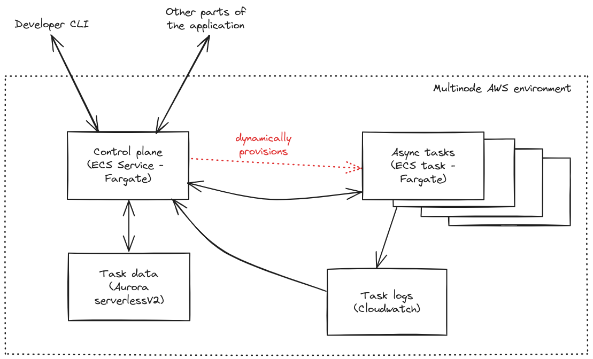

### What is Multinode?

**Multinode** allows you to rapidly deploy scalable applications with **asynchronous tasks**.

Consider using multinode if your application runs tasks that:
- are **triggered on demand** by the user of the application;
- take of the order of **minutes or hours** to complete;
- require **expensive hardware** that should be provisioned only when required.

For example, multinode can be used within:
- a document/image/video processing app
- a data analytics app
- a scientific computing app

The main benefits of multinode are:
- **Minimal boilerplate:** Cloud API calls, cloud permissions,
task lifecycle management and task data storage are abstracted away.
- **Responsive scaling:** Compute resources are spun up as soon as a task is created,
and torn down as soon as the task is complete.


### Quick start

Deploy the multinode control plane into your AWS account.
(Instructions and Terraform code provided in the [aws-infra](aws-infra/README.md) folder.)

Install the multinode Python package and authenticate with the Multinode control plane.
```commandline
pip install multinode
multinode login
```

Define the task as a Python function.
```python
# File: tasks/main.py

from multinode import Multinode

mn = Multinode()

@mn.function(cpu=4.0, memory="16 GiB")
def run_expensive_task(x):
    out =  # ... details of the task ...
    return out
```

Register the function with the multinode control plane.
```commandline
multinode deploy tasks/ --project-name=my_project
```

Implement the rest of the application, invoking the function when needed.
```python
# File: application/main.py
# NB can be a different codebase from tasks/

from multinode import get_deployed_function

run_expensive_task = get_deployed_function(
    project_name="my_project",
    function_name="run_expensive_task"
)

# ... other code ...

# Start a task invocation.
# The computation runs on *remote* hardware, which is *provisioned on demand*.
invocation_id = run_expensive_task.start(x=10000)

# ... other code ...

# Get the status of the task invocation, and the result (if available)
invocation = sum_of_squares.get(invocation_id)
print(invocation.status)  # e.g. PENDING, RUNNING, SUCCEEDED
print(invocation.result)  # e.g. 12345 (if available), or None (if still running)
```


### Further functionality

In addition to the above basic functionality, Multinode allows you to:
- Expose progress updates from an in-flight task.
- Cancel a task programmatically.
- Implement retries in case of code errors or hardware failures.
- Configure timeouts and concurrency limits.
- Spawn subtasks from a parent task.
- Inspect task logs.
- Add custom Python dependencies and environment variables.
- Manage the lifecycle of the deployed application.

For further details, see
the [reference guide](python-client/README.md)
or the [worked example](example-project/README.md).


### Approaches to scaling: When to use Multinode?

**Multinode's approach: Direct resource provisioning.**
Multinode makes _direct API calls_ to the cloud provider, to provision a _new worker_ for _each new task_.

**Alternative approach: Autoscaling a warm worker pool.**
Popular alternative frameworks for asynchronous tasks include Celery and Kafka consumers.
Applications written in these frameworks usually run on a warm pool of workers.
Each worker stays alive between task executions.
The number of workers is _autoscaled_ according to some metric (e.g. the number of pending tasks).

Advantages of Multinode's approach:
- Scales up _immediately_ when new tasks are created; scales down _immediately_ when a task finishes.
- No risk of interrupting a task execution when scaling down.

Advantages of the alternative warm-pool-based approach:
- More suitable for processing a _higher volume_ of _shorter-lived_ tasks. 
- Can maintain spare capacity to mitigate against cold starts.


### Architecture

Currently, Multinode runs on **AWS**, using **ECS/Fargate** for the asynchronous tasks.

A (slightly simplified) architecture diagram is shown below



With minimal API changes, the framework can be extended to
other AWS compute engines (e.g. EC2 with GPUs), to other cloud providers, and to Kubernetes.

We may implement these extensions if there is demand. 
We also welcome contributions from the open source community in this regard.

Currently, you need to deploy Multinode in _your own_ AWS account.
(Terraform is provided in the [aws-infra](aws-infra/README.md) folder.)
We may offer Multinode as a managed service in the future.


### Programming language support

Python is the only supported language at the moment.

If you need to _invoke_ a deployed Python function from an application written in
another language such as Javascript, then you will need to use the REST API.
(Or you can contribute a Javascript client!)

Let us know if you want to _define_ your functions in other languages.
