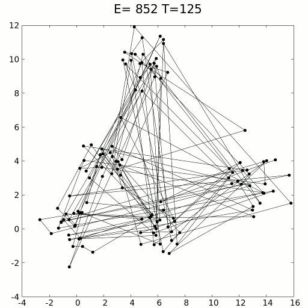
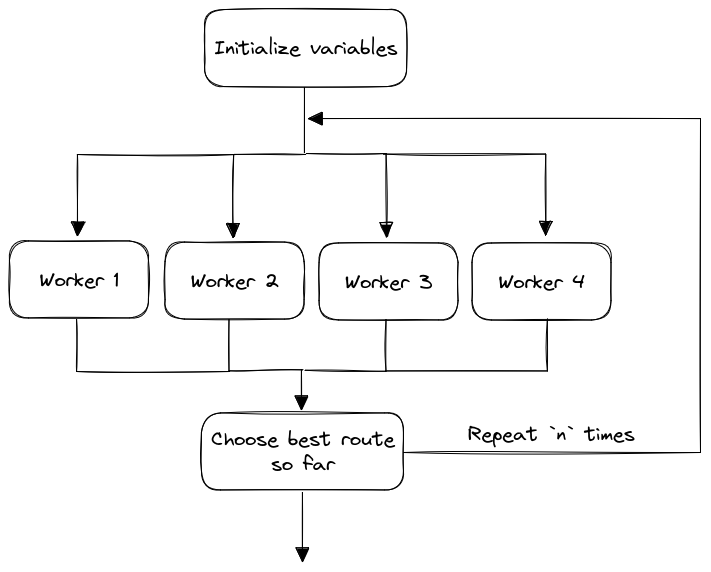

# Solving the travelling salesman problem with Multinode

In this example we will use Multinode to solve the classic 
[travelling salesman problem](https://en.wikipedia.org/wiki/Travelling_salesman_problem) (TSP)
using the [simulated annealing](https://en.wikipedia.org/wiki/Simulated_annealing) (SA) algorithm.


## Overview of simulated annealing for TSP
TSP is a well known problem, where, given a list of cities and the distances between
them, the goal is to find the shortest possible route that visits each city exactly once,
and returns to the origin city.

The classic SA algorithm works as follows:
  1. Initialize the `temperature` parameter to some large value.
  2. Initialize the `cooling_rate` parameter to a value between 0 and 1 (usually very close to 1).
  3. Initialize `current_route` to a random route.
  4. Repeat `iterations` times (e.g., `iterations=10_000`): 
     1. Perturb the current route to get a new candidate route 
        (e.g., swap order of two random cities - if Los Angeles was 2nd on the route 
         and New York was 5th, make Los Angeles 5th and New York 2nd).
     2. Accept the new candidate route as the current route with probability:
        `p = exp((current_route_length - new_route_length)/temperature)`.
        (If the new route is shorter, the probability will be > 1, so it will definitely be accepted.
         Otherwise, the probability will be between 0 and 1 and: (i) the higher the temperature, 
         the higher the probability, (ii) the higher the difference between the two route lengths, 
         the lower the probability.)
     3. Reduce the temperature by multiplying by the cooling rate: `temperature = temperature * cooling_rate`.

A visualization of simulated annealing applied to the travelling salesman problem in
a setting with 125 cities arranged in 5 clusters:



## Distributed simulated annealing

Rather than implementing the classic simulated annealing algorithm, we will implement a variant
that takes advantage of distributed parallel compute, thus showcasing the full power of Multinode.

1. Initialize the `temperature` parameter to some large value.
2. Initialize the `cooling_rate` parameter to a value between 0 and 1 (usually very close to 1).
3. Initialize `current_route` to a random route.
4. Repeat `top_level_iterations` times (e.g., `top_level_iterations=5`):
   1. Run `n_workers` workers (e.g., `n_workers=4`),
      where each worker independently runs `worker_iterations` 
      iterations of the classic SA algorithm, starting from the `current_route` and the current `temperature`.
      (Each iteration of the classic SA algorithm involves perturbing the route to get a new candidate,
       accepting or rejecting the candidate, and reducing the temperature.)
      Crucially, each worker is seeded with a different random `seed`.
   2. Get the final route from each worker and select the shortest one as the new `current_route`.

You can visualize this workflow as follows:



At any given moment, we have not one but `n_workers` machines working on the problem at 
the same time. At regular intervals, the machines share their results and pick the 
best route so far to continue with. This way, we arrive at the solution much faster than
by running code locally or on a single cloud machine.

## A distributed SA TSP solver API with Multinode

### Project structure
Our application consists of 3 files:

#### [tasks/main.py](tasks/main.py)
This is the implementation of the distributed SA TSP solver,
which we will register with the Multinode control plane.
It follows the structure described in the 
[definitions API reference](../python-client/docs/definitions.md).

`tasks/main.py` defines two Multinode functions: `solve_tsp` and `simulated_annealing`.

The `solve_tsp` function orchestrates the entire distributed SA algorithm end-to-end.

```python
@mn.function(cpu=0.1)
def solve_tsp(
        n_cities: int,
        distances: np.ndarray,
        top_level_iterations: int = 5,
        worker_iterations: int = 500_000,
        n_workers: int = 4,
        initial_temperature: float = 20.0,
        cooling_rate: float = 0.999997,
):
    ...
```

In each iteration of the algorithm, `solve_tsp` dispatches `n_workers` workers
running the `simulated_annealing` function:

```python
@mn.function(cpu=4)
def simulated_annealing(
        curr_route: np.ndarray,
        distances: np.ndarray,
        n_iterations: int = 1000,
        temp: float = 1000,
        cooling_rate: float = 0.999,
        seed: int = 0,
):
    ...
```

#### [tasks/requirements.txt](tasks/requirements.txt)
This is the list of Python dependencies that we want to install on each Multinode worker.

#### [application/main.py](application/main.py)
This is a FastAPI app that allows users to trigger the travelling salesman calculation via API calls.

We will run this app locally, but it is also possible to run it
on any machine with access to the internet - for example,
an EC2 instance, your own ECS cluster, Google Cloud Run, Heroku, etc.

`application/main.py` accesses `solve_tsp` via the `get_deployed_function` method:
```python
from multinode import get_deployed_function

solve_tsp = get_deployed_function(
    project_name="tsp-solver",
    function_name="solve_tsp"
)
```

`application/main.py` defines 3 API endpoints:
  - `POST /tsp` - uses `solve_tsp.start(np.arange(50), np.random.rand(50, 50))`  
    to start a new invocation of `solve_tsp`. Returns the `invocation_id` of this invocation.
    The input to `solve_tsp` consists of 50 cities numbered from 0 to 49, with random distances between each pair. 
  - `GET /tsp/{invocation_id}` - uses `solve_tsp.get(invocation_id)` to get the
    status of the invocation with ID `invocation_id`, and its latest result.
  - `PUT /tsp/{invocation_id}/cancel` - uses `solve_tsp.cancel(invocation_id)` to
    cancel the invocation with ID `invocation_id`.

### Running the code

To run this example, make sure that:
 - you have [Python](https://www.python.org/downloads/),
   [Pip](https://pip.pypa.io/en/stable/installation/),
   and [Docker](https://docs.docker.com/get-docker/) installed on your system
 - you have [installed Multinode in your AWS account](../../aws-infra/README.md)

You also need to install additional Python dependencies:
```commandline
pip install multinode fastapi uvicorn numpy
```
And if you have not already done so, you need to authenticate with the Multinode control plane:
```commandline
multinode login
```

#### Registering the functions with the Multinode control plane

You can now register the `solve_tsp` and `simulated_annealing` functions
with the Multinode control plane, under the project name `tsp-solver`:
```commandline
multinode deploy tasks/ --project-name tsp-solver
```
(This assumes that you are currently in the [example-project](.) directory.)

`tsp-solver` should now appear under the list of projects:
```commandline
multinode list
```

And `solve_tsp` and `simulated_annealing` should appear as functions registered under the project `tsp-solver`.
```commandline
multinode describe --project-name tsp-solver
```

#### Running the API

All that remains is to start the FastAPI app, so that users can trigger the travelling salesman calculation
via API calls:
```commandline
uvicorn application.main:app --reload
```

And you're done!

#### Calling the API

As a user, you can send requests to the API using the `curl` command. 

First, dispatch a TSP solver task:
```commandline
curl -X POST http://127.0.0.1:8000/tsp
```
Take note of the `INVOCATION_ID` in the response.

Then, periodically, check the status of the task:
```commandline
curl http://127.0.0.1:8000/tsp/INVOCATION_ID
```

You should notice the response changing over time:
 - Initially, the response is `Provisioning resources for the invocation.`
 - When cloud resources have been provisioned, the response changes to `Invocation is running.`
 - Once the first intermediate results are in, the response becomes
   `Invocation is running. Best distance so far: <some value>`. The value
   will keep changing after each top-level iteration.
 - Eventually, when the task finishes, the response becomes 
   `Invocation finished. Best distance: <some value>`.

If at any point you decide to cancel the invocation, you can run:
```commandline
curl -X PUT  http://127.0.0.1:8000/tsp/INVOCATION_ID/cancel
```

This is of course only a toy example of using Multinode deployed functions as a part of 
a larger application. In practice, you can trigger Multinode functions in any way you want - from
a Python API, a cronjob, a Lambda function, or even your frontend!
